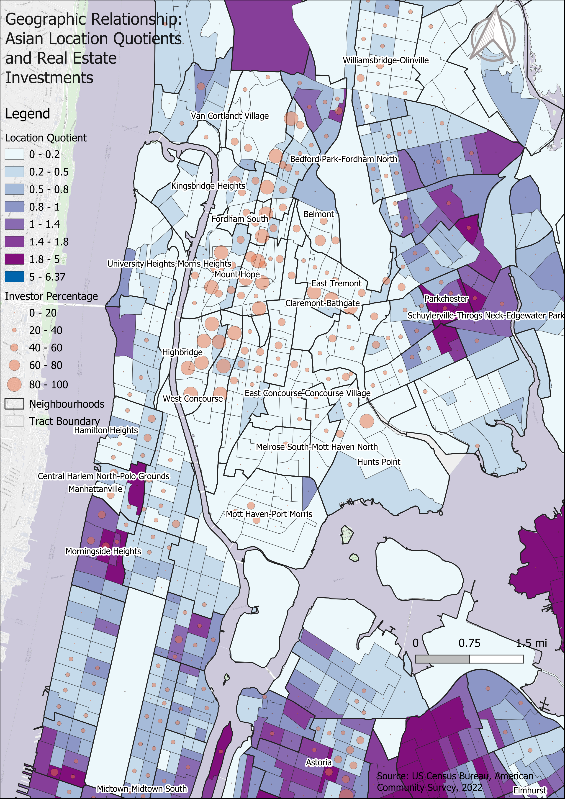
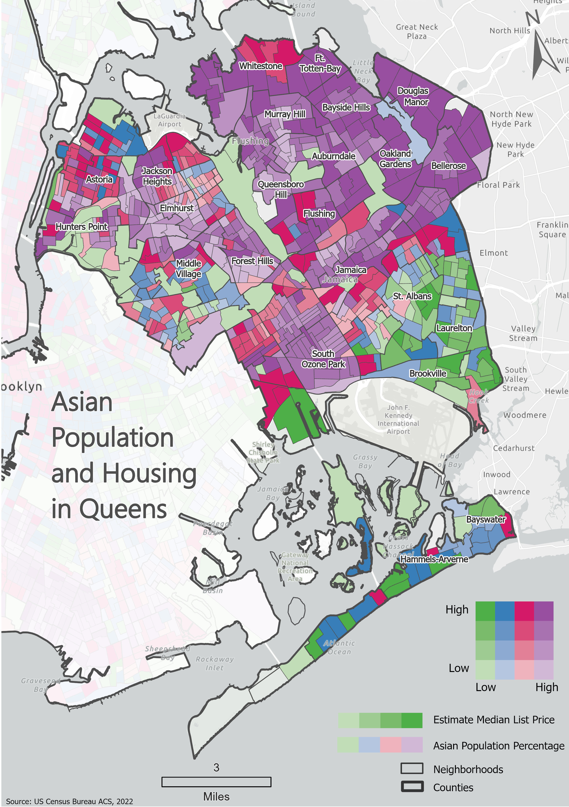
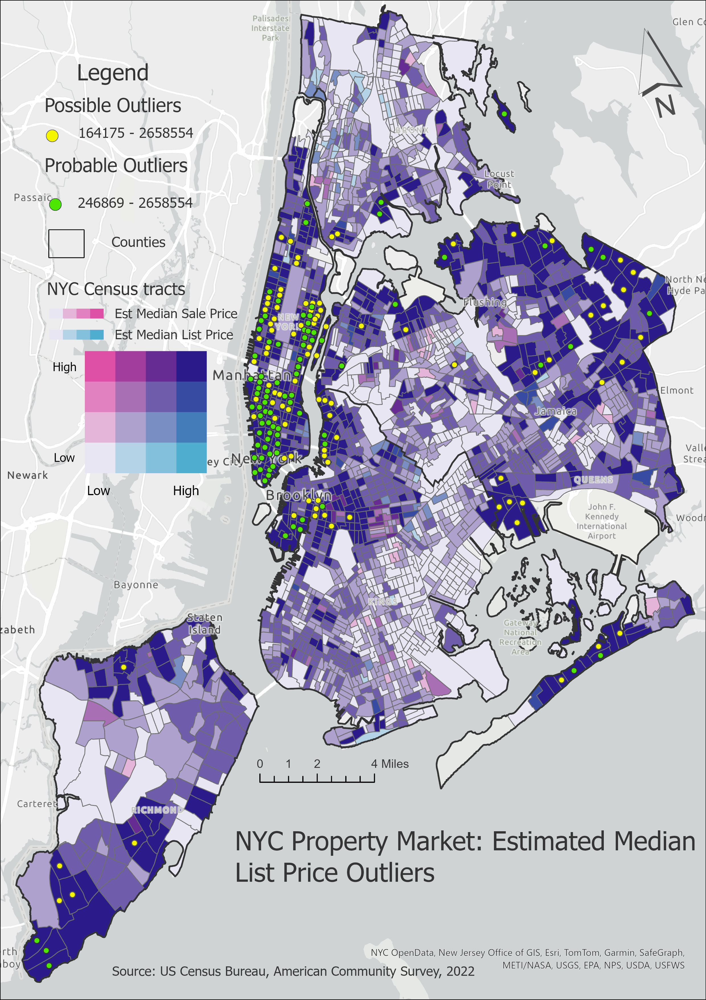
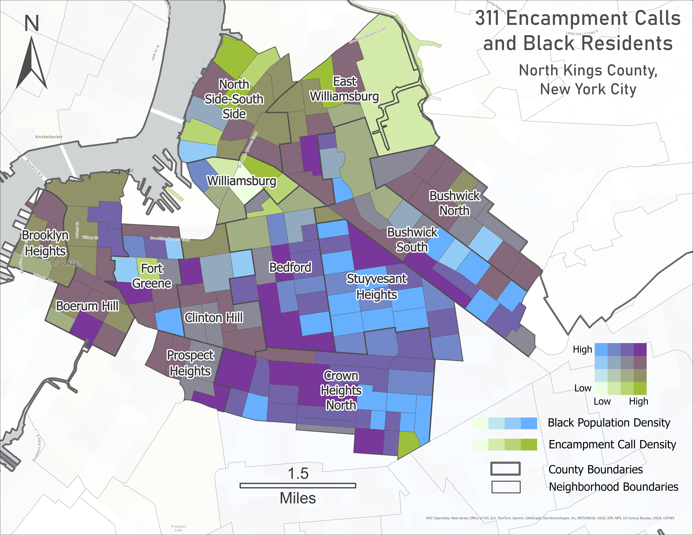

# Critical-and-Ethical-Aspects-of-Mapping-Projects

### Title: Creating a Thematic Map from Race & Ethnicity Data

#### Assignment Three

#### Submission data: 10-05-2024

#### Description:

This exercise involves analyzing and visualizing the spatial
distribution of the Black or African American population across New York
City using thematic mapping techniques. The project emphasizes comparing
group differences, employing a quantile classification scheme and an
inverted Plasma color ramp to highlight demographic patterns

  
 

    Black Residents Percentage in NYC
  </figcaption>

 
### Title: Mapping Race and Housing Market Estimates in NYC

#### Assignment Five

#### Description:

This assignment explores the relationship between the Asian population
distribution (Location Quotient, LQ) and housing market investment
levels (PCT\_INVST) across New York City. Using thematic mapping
techniques, the analysis highlights geographic patterns of racial
inequality in housing investments, revealing disparities between areas
with high Asian population concentrations and investor activity. Two
maps were created:

Map 1 focuses on the Bronx, where regions with low LQ, such as Mount
Hope and Morris Heights, show high investment, while clusters like
Parkchester with relatively high LQ exhibit low investor activity. Map 2
extends the analysis across NYC, uncovering high investment in Kings
County (e.g., Bushwick North, Stuyvesant Heights) and low investment in
high LQ areas of Queens (e.g., Flushing, Elmhurst) and Southern Kings
County. The findings reveal disparities influenced by factors such as
zoning, socioeconomic demographics, and neighbourhood infrastructure.
Investors prioritize regions with strong infrastructure and development
potential, often overlooking areas with dense Asian populations. This
analysis underscores the need for targeted strategies to address
investment gaps and promote equitable housing opportunities.

  
  
  

    Bronx & Kings - Asian Population Location Quotients and Real Estate Investments
  </figcaption>

 

### Title: Bivariate Thematic Mapping of Asian Population Percentage and Estimated Median List Price in NYC

#### Assignment Six

#### Description:

This Exercise examines the relationship between the Asian population
percentage and estimated median list prices across New York City’s
census tracts, with a focus on Queens. Using a 4x4 bivariate thematic
map, the analysis explores how property listing prices vary in relation
to the concentration of the Asian population, revealing trends that may
indicate spatial patterns and housing market dynamics in the region. The
findings highlight the impact of demographic changes on housing prices,
with significant observations in neighborhoods like Flushing, Bayside,
and Elmhurst, where higher Asian population percentages are correlated
with rising property values.

  
  

    Bivariate Map: Asian Population Percentage and Estimated Median List Price in NYC
  </figcaption>

 

### Title: Spatial Analysis of NYC Property Market: Median Sale and List Price Outliers

#### Description:

This bivariate 4x4 map of New York City highlights the relationship
between the estimated median sale price and estimated median list price
for properties, depicted using a gradient of pink (sale price) and blue
(list price). Census tracts are color-coded based on this relationship,
while yellow and green dots mark “Possible Outliers” and “Probable
Outliers” respectively, indicating areas with unusually high or low
property prices. The map reveals a spatial correlation between estimated
median sale and list prices, with potential pricing outliers
concentrated in Manhattan and parts of Brooklyn, suggesting these areas
might have irregular property market behaviors compared to the broader
NYC trends.

  
 

    A bivariate map showing Outliers and the spatial relationship between estimated median sale and list prices across NYC census tracts
  </figcaption>

 

### Title: Bivariate Map of Black Population Density and Encampment Call Density in North Kings County, NYC

#### Description:

This bivariate map highlights the spatial patterns between Black
population density and encampment call density across neighborhoods in
North Kings County, NYC. Clusters like Stuyvesant Heights, Crown Heights
North, and Bedford exhibit significant overlap of high Black population
density and encampment calls, reflecting patterns of racial segregation.
Other neighborhoods, such as Brooklyn Heights and East Williamsburg,
show high encampment density despite low Black population density,
suggesting influences like gentrification and economic proximity to
Manhattan.

  
   
  

    Black Resident density and Encampment call density in North Kings County, NYC
  </figcaption>

